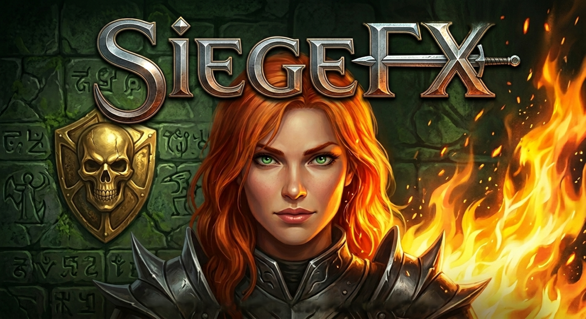

# SiegeFX



An open-source reimplementation of **Dungeon Siege** (Gas Powered Games, 2002), written in C# / .NET 8.

The goal is to run Dungeon Siege natively on modern Windows at any resolution, with a clean and moddable architecture — by loading the original game's data files directly rather than redistributing any of them.

> **SiegeFX requires the original game data.** It ships no copyrighted assets. You must own a copy of Dungeon Siege (GOG, Steam, or original discs) to use it.

## About

SiegeFX is a slow-burn reverse-engineering project: every shipped phase ends in something visibly working, and every quirk we hit along the way gets written down. The codebase is C# / .NET 8 with Silk.NET for windowing/GL/audio. It loads `.dsres` tank archives, parses the GAS template language, runs the original Skrit gameplay scripts on a clean VM, and renders ASP meshes with PRS skeletal animation. Spells, leveling, audio, and save/load are all wired against the values DS1 ships in `formulas.gas` rather than reinvented.

It is also a **clean-room** reimplementation. Every claim in the wiki and every fix in the code traces back to running our own headless audits over the bytes the original game ships — `siegefx tank list`, `siegefx raw decode`, `siegefx asp info`, `siegefx region prop-textures`, `siegefx balance curve`, `siegefx asp subset-fuzz` and friends. The 2023 leak of the original DS1 source is off-limits; you don't need it to figure this engine out, you just need patient tooling.

Most of the work that made this tractable is other people's: **Guilherme Lampert** documented the asset formats, **Scott Bilas** (GPG's lead engine programmer) wrote up the engine internals publicly, and the **SiegeTheDay** modding community kept the importer scripts alive. The credits at the bottom of this README aren't an afterthought — without that prior art this project wouldn't exist.

## Status

**`v0.15.0`** — playable across the world. Farmboy spawns at the authored start, click-to-move and click-to-attack route through the live nav mesh, equipped weapons render and animate on the hand bone, the HUD draws DS1 bitmap-font text with HP/MP bars derived from STR/DEX/INT, and `Q` / `W` cast slotted spells with per-element projectile + impact tinting (fireball reads orange, iceshard cyan, zap blue) and 3D positional audio. RMB on an NPC opens a branching dialogue panel; quests journal and persist across saves; vendors stock and trade for gold dropped by enemies. `F5` / `F9` quicksave/quickload restore the world losslessly.

A DS1-faithful character creator built from the shipped `character_select.gas` lets you pick gender / head / face / hair / shirt / pants over a live 3D preview, and the picked hero name + variant axes round-trip through quicksave (schema v5). Phase 29-CD-CREATOR landed the screen's authentic chrome: 12 spinner-arrow buttons rendered per `art_mapping.gas` recipes against `heromenu.asp` (subset 0 left-panel plate + 12 arrow subsets + GENDER/HEAD/FACE/HAIR/SHIRT/PANTS label strip), live hero preview pulled into the gas-authored listener rect (408,73,649,494), name edit-box overlay with DS1's excluded-chars rule + 14-char cap, and `backbutton_b2pn@1.0` for the prev/next pair. Misplaced `mainmenu`/`menubars` panels that were leaking main-menu chrome into cd-state are gone, and ASP shadow subsets are now drawn in their own pre-pass under the pillars instead of overlaying the buttons.

Region world events run through the same sfx_script VM as spell casts — chimneys vent smoke, cooking fires + torches throw their billboard cones, and the farmhouse mill turns: rivers, waterfalls, and the wheelfall foam are driven by the data-driven [SC-TSD-ANIM pipeline](https://github.com/codingncaffeine/SiegeFX/wiki) parsing every per-texture TSD sidecar from `Terrain.dsres`. The placed waterwheel prop spins on its own X axis from the `chore_default = rotateX?rpm=-8` skrit baked at spawn. Per-instance `aspect.scale_multiplier` is now honored at spawn time, so DS1's baked foliage variation reads correctly (≈1150 placements in fh_r1 alone) and the breakable farmhouse door inflates to its 1.5× footprint instead of reading as a clone of the everyday door.

Phase 21 polish in progress — the always-on HUD now matches DS1's status pane (HP/MP readout above STR/DEX/INT, two-panel dock arrows, four-cell active-ability bar with per-skill XP fills), inventory cells render edge-to-edge in a true grid, and scroll-wheel zoom dollies the chase camera along the view ray instead of arcing flatter as you pull back. Loot drops were over-corrected to zero in 12-SC-3; equipped buckets now roll at a 35% chance gate so corpses leave usable gear behind without becoming weapon-vending machines.

Phase 22-SC-MUSIC streams DS1's 131 mp3 tracks (`/sound/music/s_m_*.mp3`, 44 theme categories) via NLayer → OpenAL. Frontend menu music plays during the character creator and swaps to the region's mood-driven `standard_track` on Begin (fh_r1 → s_m_Farmhouse_02, crypts → s_m_Crypts_01, etc.). When any hostile NPC engages the player, music flips to the active mood's `battle_track` and reverts after 3s of disengagement. Tracks loop sample-continuous past the natural end so the soundscape stays seamless while the player camps a region. Audio extracted into a sibling `SiegeFX.Audio` project so the headless `siegefx` CLI doesn't drag in GLFW / OpenGL native runtimes. Headless `siegefx music selftest <Sound.dsres>` decodes ~185ms of frontend music to verify the NLayer + tank-extract path stays clean across NuGet bumps.

Post-ship fold (verified end-to-end in fh_r1)\* — silent-bed moods (e.g. `map_world_fh_r1_1`) now still trigger their `standard_track` instead of returning early at the bed branch; `MusicPlayer` decodes via NLayer's float-sample API (the byte-array overload was emitting noise on the DS1 corpus); the queue auto-recovers from buffer underrun so music starting during synchronous region build no longer gets clipped to silence; loop point re-seats the decoder for sample-continuous repeat. \*broader region/track coverage testing still pending.

Phase 23-SC-OPTIONS shipped an in-game Options Menu (F10) — partial coverage. Modal dialog with four tabs (Video / Audio / Input / Game) authored at DS1's 640×480 reference and scaled by viewport height to 968×828 at 1080p, 1290×1104 at 1440p ultrawide, and 1935×1656 at 4K with the bitmap font crisp at integer multiples. SC-OPTIONS-FOLD2 closed the visible layout regressions (inner panel covered tab labels; Defaults overlapped Hotkeys/More) and wired the Show Framerate toggle through to a top-right HUD readout. Audio sliders apply live during drag (Master/Music/SFX volumes plus Sound on/off mute). Most other knobs across Video / Input / Game are still persist-only — the runtime knobs they map to (resolution swap, gamma uniform, camera invert + sensitivity wiring at the chase-mode site, game speed multiplier, blood color / dismemberment toggles) are parked under splinter SC-OPTIONS-VIDEO-RUNTIME / SC-OPTIONS-PERSIST until a follow-up slice. Defaults / OK / Cancel / Esc semantics work; the menu's current state survives within the session and resets on relaunch.

Phase 24-MAINMENU graduates SiegeFX from "tech-demo CLI" to "double-clickable game.exe." Default `siegefx.exe` (no args) auto-resolves a Dungeon Siege install (env var `SIEGEFX_DS1` first, then GOG / Steam / retail-DVD common paths) and boots the splash → main menu sequence: Microsoft splash (`intro_microsoft.gas`, 3-panel RAW alpha-anim) → GPG splash (`intro_gaspowered.gas`) → 1s Bink-stub fade (real `gpg_intro.bik` decode parked as splinter SC-MAINMENU-BINK) → "Dungeon Siege" sword drop on `m_gui_fe_m_mn_3d_logo.asp` driven by `logo-enter.prs` (2.17s) inside the 6.0s `frontend_lights.gas` ramp window → seven-button main menu (Single Player / Multiplayer / Options / Continue / About / Exit / Credits) authored from `main_menu.gas` rects. Options opens the existing in-game Options dialog; About opens a copyright-attribution overlay; Exit closes the window. `--noVideo` (DS1's `nointro=true` equivalent) skips the splash sequence and jumps straight to the menu. The original `--play-region` / `--region` / `--world` / `--anim` / `--skrit-anim` / `--play-region` invocation modes still work, so the test-all.bat dev workflow is unchanged. A self-contained single-file release artifact lands via `dotnet publish src/SiegeFX.Runtime -c Release -r win-x64 --self-contained -p:PublishSingleFile=true` (~36 MB `SiegeFX.Runtime.exe` with Silk.NET's GLFW + OpenAL Soft natives bundled inside, auto-extracting on first launch). New Game / Continue / Multiplayer / Credits buttons currently log a "splinter pending" message on click — region launch from the menu (SC-MAINMENU-NEWGAME), Continue (SC-MAINMENU-CONTINUE), Multiplayer (SC-MAINMENU-MULTIPLAYER), Credits + the in-region opening NIS cinematic (SC-MAINMENU-NIS), DS1's button-wood RAW button visuals (SC-MAINMENU-BUTTONS-RAW), and the chrome-vs-panel coordinate alignment (SC-MAINMENU-CHROME-LINEUP) are all parked behind explicit splinters.

Phase 21-SC-BARREL landed the breakable-prop loop end-to-end: cursor sprite swaps live (sword for default, red sword over enemies in melee mode, blue glow over enemies in spell mode, animated hammer over breakables, animated hand over loot piles, talk marker over NPCs), barrels and crates shatter into per-material frag-mesh debris (wood / stone / clay) that arc out under gravity and settle on the prop's authored Y, the `[inventory][pcontent]` rolls drop gold + items at DS1's authored ~62/35/3 empty/gold/potion distribution for fh_r1, and shipped per-material break sounds (`s_e_env_break_container_*`) play on shatter. Player melee swings alternate the 0mid mid-arc and the high backhand sub-anims for the R→L / L→R cadence DS1 ships, complete the full 0.83s clip with a weighty recovery hold, gate at one swing per animation so click-spam doesn't multi-fire damage, and the hero pivots to face each new target before the swing fires. `siegefx region breakable-audit all` reports **1,850 breakable placements / 1,429 with pcontent / 9,402 frag entries / 199 templates with resolved break sounds** across the 81 shipped regions (was 0 across the board pre-fold — the 17-SC-K placeholder silently misread `[break_particulate]` under `[aspect]` instead of its real `[physics]` home). Five engine quirks discovered + documented in the [wiki's Engine Quirks page](https://github.com/codingncaffeine/SiegeFX/wiki/Engine-Quirks-and-Stumbles) (`.flm` cursor-frame stride, `voice:die` colon-shorthand whitespace handling, `[break_particulate]` path, `[oneof*]` sequential-roll semantics, `PlayerMeleeReach` gate threshold).

SC-QUEST-OBJ-F lands the Kingdom of Ehb catalog — 22 wiki-sourced main+side quests from Chapters I–IX (plus two legacy Phase-20c stubs Quest_for_Gyorn / quest_edgaar_basement that the existing Norick dialogue still activates) with authored screen names + objective text + chained `NextQuestKey` follow-ups (`quest_seek_gyorn` → `quest_deliver_gyorn_report` → `quest_clear_glitterdelve` → ... → `quest_vanquish_seck`). DS1's own approach: each multi-stage quest is a chained quest-ID rather than an embedded Stage[]. Pickup / Reach / Deliver / KillNamed entries ship as data today; their Register* runtimes land in slices C / B / D / E and auto-pick up the existing data. test-all.bat option 97 demonstrates the chain: launches with `SIEGEFX_DEBUG_QUEST=quest_seek_gyorn` pre-activated, then RMB Edgaar (the new chain's stub TALK target until Stonebridge streams) and the journal log records both `quest_seek_gyorn` completing and `quest_deliver_gyorn_report` auto-activating as the Chapter II follow-up. The legacy kill-3-krug `Quest_for_Gyorn` that Norick's dialogue activates is independent and unchained — clearing it doesn't fire the new chain.

SC-QUEST-OBJ-A (the first of six slices scoped from a wiki audit of all 24 Kingdom of Ehb quests) lands the talk-to-NPC objective type. `QuestDefinition` now carries `TalkTargetTemplate` + `TalkCountGoal`, `QuestJournal.RegisterTalk` mirrors the existing kill-counter loop, and the dialogue-close edge in RenderHost credits any matching active quest before the vendor-auto-open path consumes `_lastTalkedTemplate`. A new `SIEGEFX_DEBUG_QUEST=<key>[,<key>...]` env var pre-activates a quest at region-load so the receipt is testable in fh_r1 against Edgaar without needing the rest of the chain wired (test-all.bat option 96). Save schema bumps to v7 to persist talk-progress; v1..v6 saves migrate cleanly. Five more objective types (REACH location, PICKUP, DELIVER, KILL-named-actor, catalog-population) follow before the Farmhouse → Castle Ehb playtest is meaningful.

A new headless `siegefx spells visual-audit` walks every offensive spell's compiled cast sfx_script and reports a per-spell verdict (COVERED / PARTIAL / UNCOVERED) plus the catalog-wide primitive / unhandled-verb / texture tallies. After SC-SPELL-VISUAL slices A–H + sphere shipped, the audit reads **56 COVERED / 0 PARTIAL / 5 UNCOVERED**. The 5 UNCOVERED ones turn out to be sound-only stubs DS1's author flagged with a literal `// only a sound now, should hook up an effect. -ET` TODO in `iceblast_launch.gas`. The audit replaced "playtest 69 spells one by one" with "find the gaps in batch": cylinder ground rings, sray tapered streaks, fireb directional cones, motion-handle following for orbiter / trackball / lightsource / curve, additive Glow halos, real `sfx attach` / `rat` / `offset_bone` / `direction` dispatch, `waitfor` + collision gate, `get` family, a minimal if-evaluator, per-script texture honoring on cylinders, `$name` / `[N]` param-string substitution, and an omni-directional sphere primitive all landed in turn. Every primitive `sfx create` kind shipped by DS1 is now OK; the remaining unhandled verbs (`worldmsg` / `frandrange` / `randrange` / `camerashake`) are gameplay-event or random-expression scope, not visual. See the wiki's [Auditing the Spell Catalog](https://github.com/codingncaffeine/SiegeFX/wiki/Auditing-the-Spell-Catalog) for the layman walk-through.

<details>
<summary><strong>Receipts</strong> — 81 regions / 50,680 props / 7,252 NPCs / 2,829 pcontent entries / 16,275 SNO tiles / 2,086 trigger rows / 1962 PRS animations / 69 spells, every claim backed by a headless <code>siegefx</code> audit.</summary>

The clean-room rule: every claim is backed by a headless `siegefx` audit you can run yourself.

- **81 regions** — all shipped DS1 regions load through the cross-boundary streamer
- **50,680 static-prop placements** — 100% texture via the runtime resolver (`region prop-textures all`)
- **7,252 NPCs / 7,517 texture slots** — every slot resolves (`region actor-coverage all`)
- **2,626 ASP meshes** — 274 multi-subset; the BTRI cornerStart fix landed here (`asp subset-fuzz`)
- **~18,000 hero variants** — 7 bodies × ~32 skins × ~41 pants × 2 genders (`templates hero-variants`)
- **520 mood definitions + 165 SED descriptors** — region ambient beds and per-fire pitch ranges driven by data (`mood list`, `audio sed-list`)
- **626 audio cues** in `Sound.dsres`; 20 wired so far, per-category gaps mapped (`audio coverage`)
- **2,829 pcontent entries** (303 weapons across 10 classes + 435 armor templates) tagged with rarity (normal / rare / unique) — krug-class `#club/2-3` picks a generic power-2/3 club, `#armor/-rare(1)/28-80` rolls only rare-tier armor in band, `#*/-unique(2)/175-286` picks named unique drops the normal roll never sees (`pcontent dump`)
- **16,275 SNO tiles** (World + MpWorld) — every shipped retail tile parses cleanly; the doors/spots disk-order swap and the v6.2/v6.3 `general_connection_section.center` gate landed here (`region nav-fuzz`); funnel-smoothed nav follower hugs corridor corners — fh_r1 (10,10)→(30,30) walks 30.30 units vs 28.28 straight-line over 39 path triangles / 7 funnel waypoints (`region follow`); water tiles ride alongside floor in the mesh (1,435 water / 26,973 floor in fh_r1), gated by a per-actor `NavTraversal` policy — `--water=4` on `region path` swims a 6-tri pond crossing the default land-only policy refuses (`region nav`, `region path --water=N`); A* open-set rewritten from SortedSet to a duplicate-tolerant binary min-heap, **2.0× pathfinder speedup** at fh_r1 scale — 504 µs → 247 µs per probe over 173-tri paths (`region path-bench`); **land↔water seam stitching** wires Floor↔Water boundary edges that share an XZ footprint and a wadeable Y delta (≤0.5u), since DS1 authors water surfaces in their own SNOs whose vertices don't weld to the shoreline floor — fh_r1 climbs from 0/1435 to 37/1435 water tris with a Floor edge, World totals **4,907 cross-kind seams across 81 regions**; biggest-component A* under LandOnly stays at 99.4% (the residual 0.6% reflects newly-revealed floor islands reachable only via water — real topology), and an amphibious actor on (30,0,30) routes a 63-tri / 48.97u path to the (27.57,-1.5,0.70) water sample that LandOnly correctly refuses (`region nav`, `region path-fuzz`)
- **2,086 trigger rows** across the World — `[instance_triggers]` matrix language now parsed and dispatched at 20Hz alongside the message bus; 1,952/3,043 special.gas placements bear matrices, zero parse failures. 8/8 condition verbs (`actor_within_sphere`, `go_within_sphere`, `party_member_within_sphere/_bounding_box/_node`, `party_member_entered/left_trigger_group`, `receive_world_message`) and 5/5 action verbs (`send_world_message`, `fade_nodes`, `mood_change`, `set_interest_radius`, `fade_nodes_global`) dispatched; group-keyed pairing, `single_shot` / `start_active` / `delay` / `reset_duration` honored. Two-pass tick threads named `occupants_group` producers (266 rows authoring 136 distinct groups across 79 regions) into entered/left consumers — synthetic trip-tick at fh_r1 reports `entered=4, left=4`. The `when_false` action prefix lands the falling-edge channel (83 deferred actions across 23 regions) — cr_r1 trip-tick fires `when_false=11` on departure, proving the leave-side dispatch (`region triggers`)
- **Full chore dictionary loads per actor** — every `chore_*` section the template authors (default / walk / attack / die / fidget / magic / misc) is parsed at spawn and addressable by name through `Actor.GetClipIndex("chore_die")`; the chore_misc edge case (`chore_stances=ignore`, full-basename anim_files) is handled too. fh_r1 catalogue grows from 2.0 clips/actor (default + walk only) to **avg 5.99** per actor across 181 spawns (min 3, max 7); chore coverage tally: `chore_default×181, chore_fidget×181, chore_attack×179, chore_die×179, chore_walk×179, chore_magic×144, chore_misc×41` — every actor in the region resolves a chore_default (`region spawn`)
- **Mob loot drops match shipped pacing** — `siegefx loot dump <Logic.dsres> <template>` prints the parsed `[inventory][pcontent]` Equipped/Drops trees and rolls N times. Pre-fix the equipped weapon (`es_weapon_hand`) was folded into the drop pile so every kill tossed the worn axe; post-fix only `il_main` entries roll. **Receipts (200 rolls, seed 42):** `krug_grunt` drops 36/200 (avg 0.18/kill, matching the 0.15 chance gate × ~uniform 4-way pick), distribution `#weapon/12-17` 7.0%, `#armor/6-29` 4.0%, `potion_health_small` 4.0%, `potion_mana_small` 3.0% — worn `ax_d_d_1h1b_avg` stays on the body. `krug_scout` 25/200 (avg 0.12/kill, two stacked oneof* gates 1.0×0.12). `gremal` 0/200 (no `[inventory][pcontent]` in specializes chain — correct, drops nothing). The player click-attack also gates by player→target reach now (was a screen-pick tolerance — 30u-away enemies are no longer instantly hittable; the follower walks up to attack range and the swing fires when in reach), and `chore_attack` (on melee swings) + `chore_magic` (on `Q`/`W` casts) + `chore_die` (on death) actually play on every action via an override layer in `ActorHostBridge` that reads through the skrit-driven blender — 179/179 combatants in fh_r1 carry `chore_attack` and `chore_die`, 144/179 carry `chore_magic`; corpses hold the last frame of `chore_die` (clamp instead of mod) and survive quicksave/quickload via `BeginDeathChore` on restore. Player swings now match the equipped weapon class — `RefreshMotionClips` walks the whole `[chore_dictionary]` on every equip change so attack/magic/die/get_hit/fidget all rebind to the equipped weapon's stance (was idle+walk only — dagger-equipped farmboy played the unarmed punch on swings); chore_magic now rides through moving casts too, since the IsMoving→walk swap respects a pinned `ActorHostBridge.IsOverrideActive` (`siegefx loot dump`)
- **Legacy PRS v0x202 / v0x302 animation loader + TRCR resync** — both older formats decode through the same chunk dispatcher as v3, with the keylist branch synthesizing matching rot/pos arrays from the 32-byte combined `(time, quat, vec3)` keys those revisions use. **1962 / 1962 shipped DS1 .prs files parse with zero failures**: **1855 v3 (94.5%)** + 62 v0x202 + 45 v0x302; 131 carry TRCR tracer chunks (weapon-trail / ammo-hook info, layout undocumented) that the loader skips via 4-byte-aligned tag-scan resync to the next valid chunk, validated by chunk-version + KLST bone-index plausibility checks. Pre-fix every TRCR-bearing file threw `NotSupportedException` and fell through to a stub no-clip — including the farmboy stance-1 attack (`a_c_gah_fb_fs1_at.prs`), which silently demoted dagger swings to the unarmed punch chore. Post-fix the canary parses to 37 keyed bones / 211 rot keys / 0.83s and the dagger swing binds correctly. The 21 phrak / swamp_stinger / etc. actors that previously fell back to no-clip in fh_r1 now own full chore catalogues, and that shrinks the empty-catalogue cohort to **0** across the whole region (`prs fuzz`)
- **69 offensive spell templates parse end-to-end** — `[magic]` block damage / mana-cost / heal expressions evaluate against caster + target stats. SpellExpr learned the `**` power op (19 spells use it — fireball, iceshard, acid_cloud), the `#magic`/`#maxlife`/`#life`/`#src_mana`/`#src_life` placeholders, and the `[[ cond ?: a : b ]]` ternary block. Receipts: fireball L1 jumped from `0..0` (parser ate one star of `**`) to `3.85..4.67`; spell_freeze with `#maxlife=20` charges `mana=50.0` (was 0); leech_life's clamp formula evaluates to `0.7 / 0.3` across two `--src_life` cases; healing_hands' triple-ternary returns `11 / -0.61 / 4` across three context cases (`spells eval`, `spells show`). Element classification groups all 69 spells across seven buckets — Fire 27, Lightning 16, Ice 6, Holy 6, Acid 4, Death 3, Generic 7 — and the renderer tints both bolt and impact-flash from the bucket so a fireball reads orange instead of every spell sharing the same blue zap (`spells elements`)

</details>

End-to-end Farmhouse → Castle Ehb playtest is next.

Full status, roadmap, and per-phase development journal live on the [**wiki**](https://github.com/codingncaffeine/SiegeFX/wiki).

## Project layout

```
src/
  SiegeFX.Core       class library — file format parsers, no UI
  SiegeFX.Tools      unified `siegefx` CLI (tank info/list/extract, raw info/decode)
  SiegeFX.Browser    WPF asset explorer
  SiegeFX.Runtime    game / engine host (Silk.NET)
```

See the wiki's [Architecture](https://github.com/codingncaffeine/SiegeFX/wiki/Architecture) page for the subsystem map.

## Build

```
dotnet build
```

Then from `src/SiegeFX.Runtime`:

```
dotnet run -c Release
```

See the wiki's [Building and Running](https://github.com/codingncaffeine/SiegeFX/wiki/Building-and-Running) page for game-data setup and controls.

## Credits & prior art

- **Guilherme Lampert** — [reverse-engineering-dungeon-siege](https://github.com/glampert/reverse-engineering-dungeon-siege) — canonical documentation of Tank, ASP, SNO, RAW formats (MIT). Most of `SiegeFX.Core` is a port of his work.
- **Scott Bilas** — GPG's lead engine programmer, whose public writings document the Siege engine internals.
- **OpenSiege** — [github.com/OpenSiege/OpenSiege](https://github.com/OpenSiege/OpenSiege) — earlier C++/OpenSceneGraph reimplementation attempt.
- **SiegeTheDay.org** — DS1 modding community and original source of the MaxScript importers we lean on for `.prs` animation.

## License

MIT. See [LICENSE](LICENSE).
